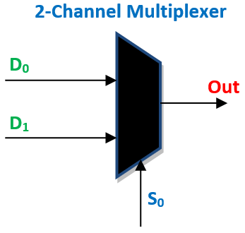

#1. Multiplexer

A multiplexer (or MUX) selects one output from a choice of inputs.



!!! TODO
    Replace with your own image

Below I've included VHDL implementing a multiplexer using two different methods.
First using a with/select assignment, then using a When/Else assignment.  
Both these modules will operate identically and how they are implemented is down to personal preference.

## Multiplexer using With/Select Assignment

``` vhdl

    library ieee;
    use ieee.std_logic_1164.all;

    entity MULTIPLEXER is
      port (
        INPUT_1 : in  std_logic_vector(3 downto 0);
        INPUT_2 : in  std_logic_vector(3 downto 0);
        SELECT  : in  std_logic;
        OUTPUT  : out std_logic_vector(3 downto 0)
        );
    end entity MULTIPLEXER;

    architecture RTL of MULTIPLEXER is
    begin
      with (SELECT) select
        OUTPUT  <=  INPUT_1 when '0',
                    INPUT_2 when '1',
                    others => '0' when others;
    end architecture MULTIPLEXER;
```

!!! Warning
    Always include a "when others" condition.    We must tell our circuit how to behave when it can determine if a signal is a 0 or a 1.  In VHDL simulation we also use Z and X states to represent high impedance and unknown states representatively.

## Multiplexer using When/Else Assignment

``` vhdl

    library ieee;
    use ieee.std_logic_1164.all;

    entity MULTIPLEXER is
      port (
        INPUT_1 : in  std_logic_vector(3 downto 0);
        INPUT_2 : in  std_logic_vector(3 downto 0);
        SELECT  : in  std_logic;
        OUTPUT  : out std_logic_vector(3 downto 0)
        );
    end entity MULTIPLEXER;

    architecture RTL of MULTIPLEXER is
    begin
      OUTPUT <= INPUT_1 when (SELECT = '0') else INPUT_2;
    end architecture MULTIPLEXER;
```
